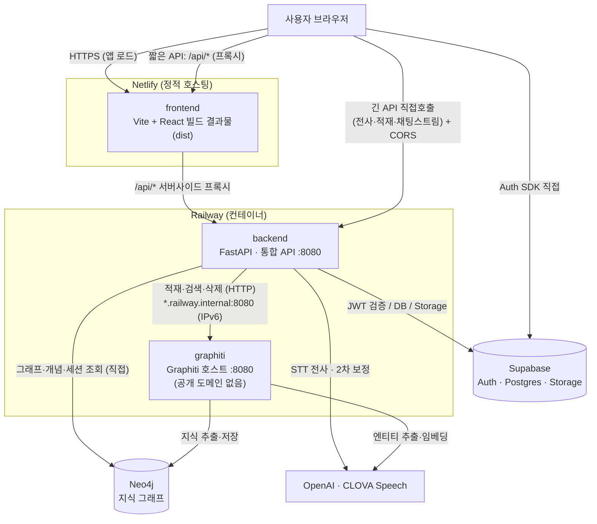

# 배포 가이드 (Deployment)

SynapVox 프로덕션 배포 구성과 절차. 세 개의 서비스(frontend·backend·graphiti)와
세 개의 외부 의존성(Supabase·Neo4j·OpenAI/CLOVA)으로 이루어진다.

> 실제 시크릿 값은 이 문서에 넣지 않는다. 환경변수 이름과 형식은
> [`.env.example`](.env.example) · [`frontend/.env.example`](frontend/.env.example) 참고.

## 아키텍처



핵심 포인트:

- **backend는 Neo4j에 두 경로로 접근한다.** 적재/검색/삭제는 graphiti HTTP를 거치지만,
  그래프·개념·세션 **조회는 backend가 Neo4j에 직접** 붙는다. 그래서 backend에도 graphiti와
  **동일한 `NEO4J_*` 자격증명**이 필요하다.
- **graphiti는 공개 도메인 없이 내부망으로만** 호출한다. graphiti 엔드포인트에는 인증이
  없어서 외부 노출 시 누구나 그래프를 읽고/지울 수 있다.
- **긴 요청은 Netlify 프록시(~26초 타임아웃)를 우회**해 backend를 직접 호출한다(전사는 실측
  ~150초). 이 직접 호출을 위해 backend에 CORS 허용이 필요하다.

## 서비스 구성

| 서비스 | 플랫폼 | 소스 | 빌드 | 공개 |
| --- | --- | --- | --- | --- |
| frontend | Netlify | `frontend/` | `netlify.toml` (Vite) | ✅ 사이트 |
| backend | Railway | `backend/` (Root Directory) | Railpack (Python 자동감지) | ✅ API |
| graphiti | Railway | 저장소 루트 (Root Directory 비움) | [`Dockerfile.graphiti`](Dockerfile.graphiti) | ❌ 내부망 전용 |

---

## 1. frontend — Netlify

설정 파일: [`frontend/netlify.toml`](frontend/netlify.toml) (빌드 커맨드·`/api` 프록시·SPA fallback 포함)

**사이트 설정**

| 항목 | 값 |
| --- | --- |
| Branch | `main` |
| Base directory | `frontend` |
| Build command / Publish | 비움 (netlify.toml이 `npm run build` → `dist` 적용) |

**환경변수** (Netlify → Site configuration → Environment variables). Vite는 빌드 시점에
`VITE_*`를 번들에 인라인하므로 **값 변경 시 반드시 재빌드(Trigger deploy)** 해야 한다.

| 이름 | 설명 |
| --- | --- |
| `VITE_SUPABASE_URL` | Supabase 프로젝트 URL. 없으면 로그인/저장이 전부 비활성 |
| `VITE_SUPABASE_ANON_KEY` | Supabase publishable/anon 키 (공개용) |
| `VITE_API_BASE_URL` | backend 절대 주소. 긴 요청(전사·적재·채팅스트림)을 프록시 우회해 직접 호출하는 데 사용 |

`/api/*` 짧은 요청은 `netlify.toml`이 backend로 서버사이드 프록시하므로 CORS가 필요 없다.
긴 요청 4개(`/api/stt/transcribe`, `/api/ingest-stt`, `/api/ingest-doc`, `/api/ask-stream`)만
`VITE_API_BASE_URL`로 직접 호출한다(→ backend CORS 필요, 아래 참고).

---

## 2. backend — Railway

**서비스 설정**

| 항목 | 값 |
| --- | --- |
| Root Directory | `backend` |
| Builder | Railpack (Python 자동감지) |
| Start Command | `uvicorn integration.api.main:app --host 0.0.0.0 --port $PORT` |
| Public domain target port | **컨테이너 리슨 포트와 일치**시킬 것 (로그의 `Uvicorn running on 0.0.0.0:<포트>` 확인) |

**환경변수** (Railway → Variables). `NEO4J_*` · `OPENAI_API_KEY`는 graphiti와 공유하므로
**Shared Variables** 사용을 권장(불일치 방지).

| 이름 | 설명 |
| --- | --- |
| `SUPABASE_URL` | Supabase 프로젝트 URL (JWT 검증 JWKS) |
| `SUPABASE_ANON_KEY` | Supabase anon 키 |
| `SUPABASE_DB_URL` | Postgres 연결문자열 (**Session Pooler** 문자열 사용) |
| `NEO4J_URI` / `NEO4J_USERNAME` / `NEO4J_PASSWORD` / `NEO4J_DATABASE` | Neo4j 접속 (graphiti와 동일 값) |
| `OPENAI_API_KEY` | 2차 보정·임베딩·AI 답변 |
| `GSVX_BASE_URL` | graphiti 내부 주소 (아래 §4) |
| `CLOVA_SPEECH_INVOKE_URL` / `CLOVA_SPEECH_SECRET` | CLOVA Speech 전사 |
| `SYNAPVOX_ALLOWED_ORIGINS` | 긴 요청 직접 호출용 CORS 허용 출처(쉼표 구분). 예: frontend 도메인 |
| `SYNAPVOX_ADMIN_EMAILS` | (선택) 관리자 이메일 |

---

## 3. graphiti — Railway

호스트: [`backend/integration/graphiti_host.py`](backend/integration/graphiti_host.py) —
공식 Graphiti 엔진을 프로세스 수명 동안 살려 두는 커스텀 FastAPI 호스트.

**서비스 설정**

| 항목 | 값 |
| --- | --- |
| Root Directory | **비움 (저장소 루트)** — `backend/`가 빌드 컨텍스트에 있어야 함 |
| Builder / Dockerfile Path | `Dockerfile.graphiti` |
| 공개 도메인 | **만들지 않음** (인증 없음 — 내부망 전용) |

[`Dockerfile.graphiti`](Dockerfile.graphiti)는 `graphiti_core`/`graph_service`를
`services/graphiti` submodule이 pin한 커밋과 동일한 커밋에서 GitHub로 직접 설치한다
(submodule 체크아웃 의존성 제거 + graph-service의 `graphiti-core` 버전을 pin 커밋으로 고정).
uvicorn은 `--host ::`로 IPv6에 바인딩한다(Railway 내부망 = IPv6).

**환경변수** (backend와 공유 권장)

| 이름 | 설명 |
| --- | --- |
| `NEO4J_URI` / `NEO4J_USERNAME` / `NEO4J_PASSWORD` / `NEO4J_DATABASE` | Neo4j 접속 |
| `OPENAI_API_KEY` | 엔티티 추출·임베딩·크로스인코더 (기동 시점에 필요) |
| `GRAPHITI_MODEL` | (선택) 추출 모델 (기본 `gpt-5-mini`) |

---

## 4. backend ↔ graphiti 내부 연결

Railway 내부망은 **IPv6**다. backend Variables에서 참조 변수로 graphiti 내부 주소를 잡는다:

```
GSVX_BASE_URL=http://${{<graphiti-서비스명>.RAILWAY_PRIVATE_DOMAIN}}:${{<graphiti-서비스명>.PORT}}
```

- `<graphiti-서비스명>` 자리는 실제 서비스 이름 그대로(대소문자·언더스코어 포함). Railway가
  내부 도메인·포트를 자동 치환하므로 이름 변환을 직접 신경 쓰지 않아도 된다.
- graphiti가 `--host 0.0.0.0`(IPv4 전용)로 떠 있으면 내부(IPv6) 접속이 안 된다 →
  `Dockerfile.graphiti`의 `--host ::` 확인.

---

## 5. Supabase 설정

- **Authentication → URL Configuration**: Site URL / Redirect URLs에 배포된 frontend
  도메인을 추가(회원가입 확인 메일 링크가 이 도메인으로 돌아온다).
- **마이그레이션**: [`supabase/migrations/`](supabase/migrations/)의 SQL을 Supabase 프로젝트에
  적용(projects · project_sources · recording_transcripts · chat_sessions 테이블 + Storage
  버킷 `project-files` + RLS 정책).

---

## 6. 트러블슈팅 (실제로 겪은 것들)

| 증상 | 원인 | 해결 |
| --- | --- | --- |
| Railpack이 "no project detected"로 빌드 실패 | 저장소 루트엔 README뿐, 모노레포 | 서비스별 Root Directory를 하위 폴더로 지정 |
| backend 기동 즉시 `FileNotFoundError: /backend/stt/...` | `backend/`를 배포 루트로 쓰면 경로 계산(`parents[]`)이 어긋남 | `__file__` 기준 `BACKEND_ROOT`로 고정 (수정 완료) |
| 그래프 엔드포인트 첫 호출에서 `ModuleNotFoundError: kiwipiepy` | `pipeline.py`가 `keyword_prompt` import 시 로드 | `backend/requirements.txt`에 `kiwipiepy` (완료) |
| 공개 URL이 계속 502 "Application failed to respond" | 도메인 target 포트 ≠ 앱 리슨 포트 | Networking에서 target 포트를 앱 포트와 일치 |
| graphiti 기동 실패 `OpenAIError: Missing credentials` | `OPENAI_API_KEY` 미설정 | graphiti Variables에 추가 |
| backend→graphiti 내부 호출 연결 안 됨 | 내부망 IPv6인데 앱이 IPv4로만 바인딩 | uvicorn `--host ::` |
| `/api/graph`에서 `Neo.ClientError.Security.Unauthorized` | backend의 `NEO4J_*`가 graphiti와 불일치/누락 | 동일 값으로 맞춤(Shared Variables 권장) |
| 로그인 시 "Supabase 연결 설정을 확인해주세요" | 빌드에 `VITE_SUPABASE_*` 누락(또는 `VITE_` 접두어 빠짐) | Netlify env에 `VITE_` 이름으로 넣고 재빌드 |
| "전사 요청에 실패했습니다" (~26초 뒤) | 전사(~150초)가 Netlify 프록시(~26초) 타임아웃 초과 | 전사 등 긴 요청은 `VITE_API_BASE_URL`로 backend 직접 호출 + CORS |

---

## 7. 로컬 개발

`.claude/launch.json`에 세 서비스 기동 설정이 있다(frontend :5173 / backend :8000 / graphiti :8020).
graphiti는 submodule + 전용 venv가 필요하다:

```bash
git submodule update --init --recursive
./scripts/setup_graphiti.sh   # services/graphiti/server/.venv 생성 + editable 설치
./scripts/run_graphiti.sh     # 로컬 graphiti :8020
```

frontend는 `frontend/.env.local`에서 `VITE_STT_PROXY_TARGET`으로 로컬 backend(:8000)를 프록시한다
(vite dev server 전용). `VITE_API_BASE_URL`을 비워 두면 긴 요청도 same-origin(`/api`)으로 가서
로컬 프록시를 탄다.
