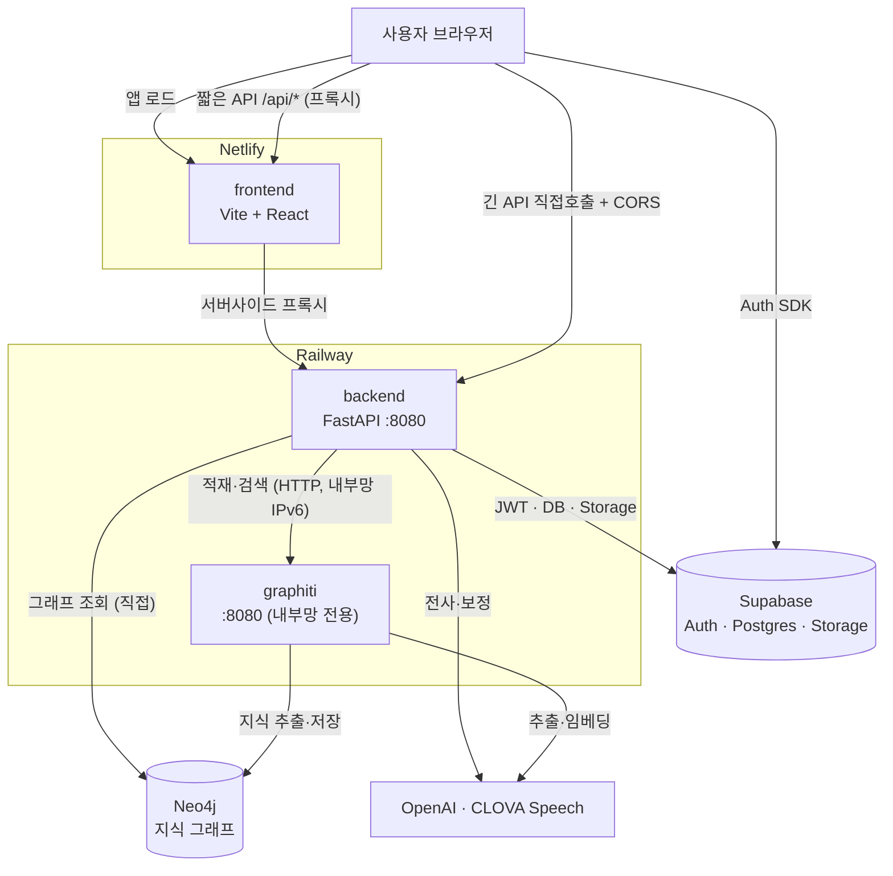

# SynapVox

강의 지식 파이프라인 — 녹음/자료 → 2-pass STT → Graphiti 지식 그래프 → 질의응답.

기획 배경과 상세 설계는 ClickUp Team Docs("회의 지식 파이프라인 MVP 구현 계획") 참고.

## 구조 (모노레포)

기술 스택 기준 `backend/`(Python) · `frontend/`(JS, 그래프 시각화)로 나누고, `backend/` 안은 파이프라인 4단계 + 통합 축으로 나눈다. 담당자 간 계약은 [`schemas/`](schemas/)의 3개 스키마이며, 이 스키마가 모듈 간 유일한 인터페이스다.

| 모듈 | 단계 | 담당 | 소유 스키마 |
| --- | --- | --- | --- |
| [`backend/stt/`](backend/stt/) | ① STT (2-pass) | 현우 | 중간 포맷 JSON |
| [`backend/chunking/`](backend/chunking/) | ② 청킹 + LLM 추출 | 도윤 | LLM 추출 JSON |
| [`backend/graphrag/`](backend/graphrag/) | ③④ Vector/Graph DB + 검색 | 용하 | Graph/Vector DB 스키마 |
| [`backend/integration/`](backend/integration/) | 통합 API/E2E (PM) | 도원 | (없음 — 통합) |
| [`frontend/`](frontend/) | 그래프 시각화 UI (PM) | 도원 | (없음 — `backend/integration` API 소비) |

## 그 외 디렉터리

- `schemas/` — 3개 계약 스키마 원본 (JSON Schema / 문서). 언어 무관이라 최상위에 둠. 변경 시 소유자가 제안하고 영향받는 담당자 합의 후 반영.
- `docs/` — 로컬 문서. 정본은 ClickUp Team Docs, 여기는 참고용 백업/링크만 둔다.
- `scripts/` — 로컬 인프라 실행 스크립트 (DB 기동 등).
- `data/` — 샘플 회의 녹음·자료. Git에는 커밋하지 않는다.

## 진행 중인 기능 브랜치 (2026-07-18)

리뷰·머지 대기 중인 브랜치와 의존 관계. 상세 내용은 각 커밋/PR 참조.

| 브랜치 | 내용 | 머지 순서 |
| --- | --- | --- |
| `test/stt-refine-batch-verification` | 2차 보정 배치 분할(P0-3) 검증 테스트 3종 | 독립 — 순서 무관 |
| `feat/graphiti-ingest-dedup` | 그래프 중복 적재 방지(P1-1) — 적재 전 `graphEpisodeIds` 검사 후 409 | 독립 — 순서 무관 |
| `feat/integration-answer-citations` | RAG 답변 인용 `[n]` + 출처 칩/드로어 + 그래프 새로고침 버튼(P0-1) | **스트리밍보다 먼저** |
| `feat/ask-true-streaming` | AI 답변 진짜 스트리밍(P1-3) — `stream=True` + 수식 경계 flush | **인용 브랜치 머지 후** (그 위에 쌓인 브랜치) |

스트리밍 동작 요약: 검색·expansion을 먼저 끝낸 뒤 LLM 토큰을 생성 즉시 NDJSON `delta`로 중계하고, 미완성 LaTeX 수식은 닫힐 때까지 버퍼링해 프론트 깜빡임을 막는다. 프론트 계약(`delta`/`complete`/`error`)은 불변.

## 시작하기

각 모듈의 `README.md`에 해당 담당자의 Baseline 작업 범위가 있다. 첫 주 목표는 `schemas/` 3종 확정.

## 배포

프로덕션은 **frontend(Netlify)** + **backend·graphiti(Railway)** + **Supabase·Neo4j·OpenAI/CLOVA** 구성이다.
서비스별 설정·환경변수·트러블슈팅은 [`DEPLOYMENT.md`](DEPLOYMENT.md) 참고.

- **backend는 Neo4j에 직접도 붙는다**(그래프 조회) → graphiti와 **동일한 `NEO4J_*`** 필요.
- **graphiti는 공개 도메인 없이 내부망 전용**(엔드포인트에 인증 없음).
- **긴 요청(전사 등, ~150초)은 Netlify 프록시(~26초)를 우회**해 backend 직접 호출.
