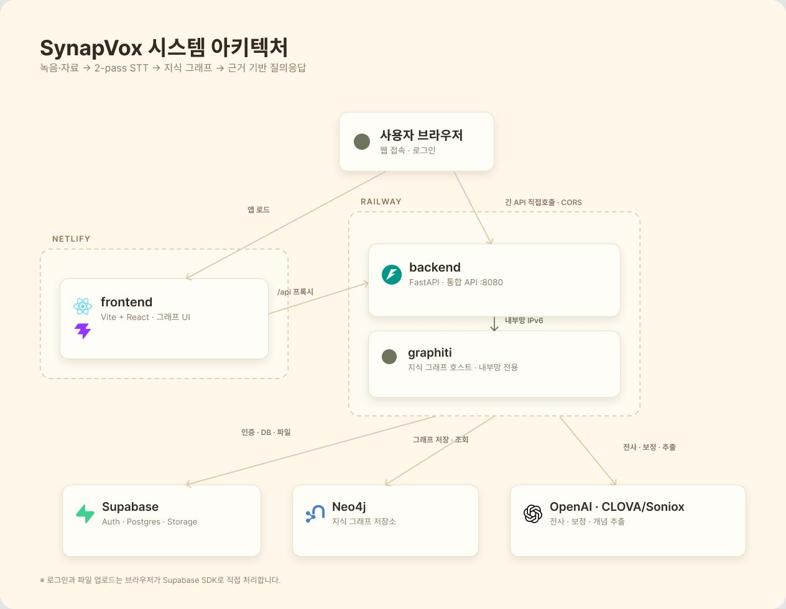
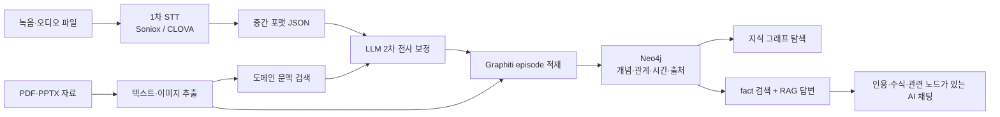

# SynapVox

> 녹음과 자료를 하나의 지식 흐름으로 연결하는 근거 기반 음성 지식 파이프라인

[](https://synapvox.netlify.app/)
[](frontend/)
[](backend/)
[](services/graphiti/)

**배포 서비스:** [https://synapvox.netlify.app/](https://synapvox.netlify.app/)

SynapVox는 강의, 회의, 인터뷰처럼 음성과 참고자료가 함께 생기는 상황을 위한 서비스입니다. 녹음 파일과 PDF/PPTX 등의 자료를 프로젝트에 모으고, 도메인 문맥을 반영한 2-pass STT로 전사한 뒤 Graphiti 기반 지식 그래프로 연결합니다. 사용자는 그래프를 탐색하거나 AI 채팅으로 질문하고, 답변에 사용된 근거와 연결 개념을 함께 확인할 수 있습니다.

---

### 1. 프로젝트 소개

#### 1.1. 개발배경 및 필요성

일반적인 음성 인식은 전문용어, 약어, 수식이 많은 강의나 회의에서 정확도가 크게 떨어집니다. 발표 자료에서 조사한 도메인 음성의 기존 STT 오류율은 WER 기준 약 17~46%였으며, 전사문과 PDF, 슬라이드, 필기 자료가 서로 다른 위치에 흩어져 있어 사용자가 다시 맥락을 조립해야 했습니다.

또한 기존의 선형 노트는 "언제 언급됐는가"는 보여줄 수 있어도 "어떤 개념과 어떤 근거로 연결되는가"를 충분히 설명하기 어렵습니다. SynapVox는 음성과 자료를 함께 해석하고 시간축과 의미축으로 연결해, 기록을 검색 가능한 지식으로 전환하고자 시작되었습니다.

#### 1.2. 개발목표 및 주요내용

SynapVox의 목표는 **녹음과 자료의 수집부터 전사, 지식 구조화, 근거 기반 질의응답까지 하나의 작업 공간에서 제공하는 것**입니다.

1. 녹음 또는 오디오 파일과 PDF/PPTX 참고자료를 프로젝트 단위로 관리합니다.
2. Soniox를 기본 엔진으로 사용하고 CLOVA Speech를 폴백으로 두어 화자 분리 전사문을 생성합니다.
3. 참고자료의 도메인 문맥과 LLM 2차 보정을 적용해 전문용어와 문장 흐름을 개선합니다.
4. 전사문과 자료를 Graphiti episode로 적재하고 개념, 관계, 근거를 Neo4j에 구성합니다.
5. 그래프 탐색과 RAG 채팅을 결합해 답변, 출처, 관련 노드를 함께 제공합니다.

#### 1.3. 세부내용

- **프로젝트 작업 공간:** 사용자별 프로젝트, 녹음본, 프로젝트 자료, 녹음별 참고자료를 분리해 관리합니다.
- **자료 이해:** PDF/PPTX의 본문뿐 아니라 표, 차트, 다이어그램, 스크린샷 등의 이미지도 Vision 모델로 설명해 전사 문맥과 그래프 적재에 활용합니다.
- **2-pass STT:** 1차 관리형 STT 결과를 공통 중간 포맷으로 정규화한 뒤, 검색된 자료 문맥을 바탕으로 2차 보정합니다.
- **화자 기반 전사문:** 발화를 화자와 타임스탬프 단위로 보여주고 수정, 복사, 북마크할 수 있습니다.
- **시간 인식 지식 그래프:** 세션은 episode, 핵심 개념은 entity, 사실 관계는 edge로 저장합니다. Graphiti의 bi-temporal 모델을 이용해 변경된 지식과 과거 맥락을 함께 추적합니다.
- **근거 기반 AI 채팅:** 그래프의 fact를 검색해 답변하고, 인용 표기와 출처 세션을 제공하며 관련 노드를 그래프에서 강조합니다.
- **표현력 있는 답변:** Markdown, 표, 목록, 코드, LaTeX 수식을 렌더링하고 스트리밍 응답을 지원합니다.
- **운영 관측:** LangSmith로 모델 호출의 지연시간, 토큰, 비용, 재시도와 프로젝트/녹음 식별자를 추적할 수 있습니다.

#### 1.4. 기존 서비스 대비 차별성

| 구분 | 일반 STT/노트 서비스 | 일반 문서 기반 AI | SynapVox |
| --- | --- | --- | --- |
| 입력 | 녹음 중심 | 문서 중심 | 녹음, 직접 녹음, PDF/PPTX 자료 통합 |
| 전사 | 범용 음성 인식 | 해당 없음 | 자료 문맥을 활용한 2-pass 보정 |
| 지식 구조 | 시간순 전사문/요약 | 청크 검색 | 개념·관계·시간·출처를 연결한 Graphiti 그래프 |
| 질의응답 | 전사문 검색 또는 요약 | 벡터 유사도 기반 답변 | fact 검색, 출처 인용, 관련 그래프 포커싱 |
| 변경 추적 | 제한적 | 최신 문서 중심 | bi-temporal 모델로 과거/현재 사실 구분 |
| 교체 가능성 | 서비스 종속 | 모델 종속 | 공통 중간 포맷으로 STT/LLM 엔진 교체 가능 |

#### 1.5. 사회적 가치 도입 계획

- 음성으로만 남아 다시 찾기 어려웠던 수업, 회의, 인터뷰 지식을 검색 가능한 자산으로 전환합니다.
- 화자와 타임스탬프, 인용 출처를 함께 제공해 AI 답변의 검증 가능성과 책임성을 높입니다.
- 청각 정보 접근이 어려운 사용자와 노트 작성 부담이 큰 사용자의 학습·업무 접근성을 개선합니다.
- 민감한 음성 자료를 위한 온프레미스/클라우드 혼합 배포와 보존 정책을 향후 지원할 계획입니다.

---

### 2. 상세설계

#### 2.1. 시스템 구성도



프로덕션은 Netlify의 React 프론트엔드와 Railway의 FastAPI/Graphiti 서비스로 구성됩니다. 인증, 관계형 데이터, 파일 저장은 Supabase가 담당하고, 지식 그래프는 Neo4j에 저장합니다. OpenAI는 보정·개념 추출·임베딩·답변 생성에, Soniox/CLOVA는 1차 전사에 사용합니다.

#### 2.2. 사용기술

| 영역 | 기술 | 역할 |
| --- | --- | --- |
| Frontend | React 19, TypeScript, Vite 8 | 프로젝트·전사문·그래프·AI 채팅 UI |
| Graph UI | react-force-graph-2d | 노드/엣지 시각화, 이동·확대·포커싱 |
| Content UI | react-markdown, remark-gfm, KaTeX | Markdown 및 LaTeX 답변 렌더링 |
| Backend | Python 3.12, FastAPI, Uvicorn | 인증된 통합 API와 E2E 파이프라인 |
| STT | Soniox, CLOVA Speech | 화자 분리 1차 전사와 폴백 |
| LLM/Vision | OpenAI | 전사 보정, 이미지 설명, 개념 추출, RAG 답변 |
| Knowledge Graph | Graphiti, Neo4j | episode/entity/fact 기반 시간 인식 지식 그래프 |
| Relational/Vector DB | Supabase Postgres, pgvector | 프로젝트·소스·전사·채팅·검색 데이터 |
| Auth/Storage | Supabase Auth, Storage | 사용자 인증과 원본 파일 저장 |
| Observability | LangSmith | 모델 호출 추적, 지연·비용·오류 관측 |
| Deployment | Netlify, Railway | 프론트엔드와 백엔드/Graphiti 배포 |

---

### 3. 개발결과

#### 3.1. 전체시스템 흐름도



#### 3.2. 기능설명

##### `홈 및 프로젝트`

- Supabase Auth 기반 회원가입·로그인과 사용자별 프로젝트 격리를 제공합니다.
- 프로젝트를 생성하고 즐겨찾기, 공유됨, 휴지통 상태로 관리합니다.
- 삭제된 프로젝트는 휴지통에서 복원하거나 관련 DB·Storage·Graphiti 데이터를 영구 삭제할 수 있습니다.

##### `녹음 및 자료`

- 브라우저에서 직접 녹음하거나 WAV, MP3, M4A, WebM, MP4 파일을 업로드합니다.
- 프로젝트 전체에서 공통으로 참고할 자료와 특정 녹음에만 적용할 참고자료를 관리합니다.
- PDF/PPTX의 텍스트와 이미지를 추출하고, 이미지 설명을 문맥에 포함합니다.

##### `전사문`

- Soniox를 기본으로 사용하고 장애 시 CLOVA Speech로 자동 전환합니다.
- 화자, 시작/종료 시각, 발화문을 공통 JSON 스키마로 정규화합니다.
- 자료에서 검색한 관련 문맥을 이용해 전문용어와 문장 흐름을 2차 보정합니다.
- 상세 화면에서 발화 수정, 복사, 북마크, 오디오 재생을 지원합니다.

##### `지식 그래프`

- 전사문과 자료를 프로젝트 범위의 Graphiti episode로 적재합니다.
- 학술 개념, 방법, 조건, 수식과 이들 사이의 fact를 Neo4j에 저장합니다.
- 세션 노드와 개념 노드의 연결을 탐색하고, 질문에 사용된 근거 노드를 확대·강조합니다.

##### `AI 채팅`

- Graphiti fact 검색 결과를 근거로 답변하며 자료가 부족하면 추측 대신 근거 부족을 알립니다.
- 답변에 인용 번호와 출처 세션을 표시하고 해당 근거를 그래프와 연결합니다.
- 대화 세션을 여러 개 생성·전환·삭제할 수 있으며 Markdown과 LaTeX를 렌더링합니다.

#### 3.3. 기능명세서

| 라벨 | 기능 | 상세 |
| --- | --- | --- |
| F1 | 사용자 인증 | Supabase 회원가입·로그인·세션 복구·로그아웃 |
| F2 | 프로젝트 관리 | 사용자별 생성, 수정, 즐겨찾기, 공유, 휴지통, 영구 삭제 |
| F3 | 소스 관리 | 프로젝트 자료와 녹음별 참고자료 업로드·검색·정렬·삭제 |
| F4 | 음성 입력 | 브라우저 녹음 및 기존 오디오/비디오 파일 업로드 |
| F5 | 1차 STT | Soniox 기본, CLOVA 폴백, 화자 분리와 타임스탬프 생성 |
| F6 | 2차 전사 보정 | 참고자료 검색 문맥을 이용한 전문용어·문장 보정 |
| F7 | 전사 상세 | 오디오 재생, 화자별 발화, 편집, 복사, 북마크 |
| F8 | 그래프 적재 | 전사문/자료를 Graphiti episode로 변환하고 Neo4j에 저장 |
| F9 | 그래프 탐색 | 프로젝트 그래프 조회, 줌·팬·노드 상세·질문 근거 포커싱 |
| F10 | AI 질의응답 | fact 검색, 스트리밍 답변, 인용, Markdown/LaTeX 렌더링 |
| F11 | 채팅 관리 | 프로젝트별 다중 대화 생성·조회·삭제 |
| F12 | 동기화 삭제 | 소스/프로젝트 삭제 시 Postgres·Storage·Graphiti 정리 |
| F13 | 관리자 운영 | 사용자·작업 큐·비용·품질·시스템 상태 확인 |
| F14 | 관측 및 평가 | LangSmith 추적, STT WER/CER, RAG 정답성·충실성 평가 |

#### 3.4. 검증결과

발표 자료에 수록된 내부 평가 결과입니다.

| 평가 | 결과 |
| --- | --- |
| STT 비교 | 9개 데이터셋 중 8개에서 Soniox WER 우세 |
| STT 평균 WER | Soniox 23.5%, CLOVA 26.9% |
| RAG 검색 Hit Rate | 텍스트 경로 98%, STT 경로 98% |
| RAG 정답성(5점) | 텍스트 4.07, STT 4.11 |
| RAG 충실성 | 텍스트 76%, STT 74% |
| 인용 정밀도 | 텍스트 95%, STT 84% |
| 과거 사실 검색 | 합성 시간축 검증 3/3 성공 |

> 현재 평가는 제한된 골드셋과 합성 시간축을 포함합니다. 화자 분리, 환각률, 실제 장기 운영 데이터에 대한 추가 검증이 필요합니다.

#### 3.5. 디렉토리 구조

```text
synapvox/
├── frontend/                 # React 프로젝트·그래프·AI 채팅 UI
├── backend/
│   ├── stt/                  # Soniox/CLOVA, 자료 추출, 2차 보정
│   ├── chunking/             # 중간 포맷 청킹과 개념 추출 계약
│   ├── graphrag/             # pgvector/Neo4j 검색 모듈
│   └── integration/          # FastAPI 통합 API, Graphiti 커넥터/호스트
├── services/graphiti/        # 고정 버전 Graphiti 서브모듈
├── schemas/                  # 모듈 간 JSON Schema 계약
├── supabase/migrations/      # 프로젝트·소스·전사·채팅 DB와 RLS
├── eval/                     # STT/RAG 골드셋과 평가 하네스
├── scripts/                  # Graphiti 설치·실행 및 운영 도구
├── docs/assets/              # README 이미지 자산
├── Dockerfile.graphiti       # Railway Graphiti 이미지
└── DEPLOYMENT.md             # Netlify/Railway 배포 상세
```

---

### 4. 설치 및 사용 방법

#### 4.1. 사전 준비

- Node.js 20 이상
- Python 3.12
- [`uv`](https://docs.astral.sh/uv/) 또는 `pip`
- Supabase 프로젝트(Postgres, Auth, Storage)
- Neo4j 데이터베이스
- OpenAI API 키
- Soniox 또는 CLOVA Speech 자격증명

#### 4.2. 저장소와 환경변수

```bash
git clone --recurse-submodules https://github.com/synapvox/synapvox.git
cd synapvox
cp .env.example .env
cp frontend/.env.example frontend/.env.local
```

`.env`와 `frontend/.env.local`에 필요한 값을 채웁니다. 실제 키는 Git에 커밋하지 않습니다.

주요 백엔드 변수:

```dotenv
SONIOX_API_KEY=
CLOVA_SPEECH_INVOKE_URL=
CLOVA_SPEECH_SECRET=
OPENAI_API_KEY=
SUPABASE_URL=
SUPABASE_ANON_KEY=
SUPABASE_DB_URL=
NEO4J_URI=
NEO4J_USERNAME=
NEO4J_PASSWORD=
NEO4J_DATABASE=
GSVX_BASE_URL=http://127.0.0.1:8020
```

주요 프론트엔드 변수:

```dotenv
VITE_SUPABASE_URL=
VITE_SUPABASE_ANON_KEY=
VITE_API_BASE_URL=http://127.0.0.1:8000
```

#### 4.3. Backend 실행

```bash
python3.12 -m venv .venv
source .venv/bin/activate
pip install -r backend/requirements.txt
python -m uvicorn backend.integration.api.main:app --reload --port 8000
```

API 문서: [http://127.0.0.1:8000/docs](http://127.0.0.1:8000/docs)

#### 4.4. Graphiti 실행

```bash
git submodule update --init --recursive
./scripts/setup_graphiti.sh
./scripts/run_graphiti.sh
```

Graphiti API 문서: [http://127.0.0.1:8020/docs](http://127.0.0.1:8020/docs)

#### 4.5. Frontend 실행

```bash
cd frontend
npm install
npm run dev
```

개발 화면: [http://127.0.0.1:5173/](http://127.0.0.1:5173/)

#### 4.6. 검증

```bash
python -m pytest backend/stt/tests backend/integration/tests backend/graphrag/tests -q
cd frontend && npm run build
```

배포 환경 구성과 트러블슈팅은 [`DEPLOYMENT.md`](DEPLOYMENT.md)를 참고하세요.

---

### 5. 소개 및 시연

[](https://synapvox.netlify.app/)

- **서비스:** [https://synapvox.netlify.app/](https://synapvox.netlify.app/)
- **핵심 시연 흐름:** 프로젝트 생성 → 자료/녹음 추가 → 2-pass 전사 → 지식 그래프 생성 → 근거 기반 AI 질문

---

### 6. 팀 소개

**SynapVox Team**은 음성 처리, 지식 그래프, 검색·생성 AI, 제품 경험을 하나의 파이프라인으로 통합했습니다.

| 담당 영역 | 주요 업무 |
| --- | --- |
| Product / Frontend | 프로젝트·소스·전사문·그래프·AI 채팅 UX |
| STT / Document AI | Soniox·CLOVA 전사, 2차 보정, PDF/PPTX 추출 |
| Graph / RAG | Graphiti·Neo4j 모델링, 검색, 인용 기반 답변 |
| Backend / Infrastructure | FastAPI 통합, Supabase, 관측, Netlify/Railway 배포 |

#### Contributors

| 이름 | 역할 | 담당 영역 |
| --- | --- | --- |
| 현우 | STT 담당 | 2-pass STT 파이프라인, 중간 포맷 JSON 스키마 |
| 도윤 | Chunking 담당 | 청킹, LLM 기반 Topic/Decision/ActionItem 추출 |
| 용하 | GraphRAG 담당 | Vector/Graph DB, Graphiti 적재, 하이브리드 검색 |
| 도원 | PM / Integration / Frontend 담당 | 통합 API, E2E 파이프라인, 그래프 시각화 UI |

---

### 7. 해커톤 참여 후기

- 하나의 모델을 교체하는 것만으로는 도메인 음성 문제를 해결하기 어렵고, 참고자료 주입과 2차 보정, 공통 스키마가 함께 필요하다는 점을 확인했습니다.
- 지식 그래프는 단순한 시각화가 아니라 시간, 개념, 출처를 검색 가능한 fact로 만드는 데이터 계층이어야 했습니다.
- AI 답변 품질은 생성 모델뿐 아니라 적재 중복 방지, 검색 범위, 인용 정밀도, 삭제 동기화와 같은 시스템 품질에 크게 좌우됐습니다.
- WER/CER와 RAG 골드셋, LangSmith 추적을 함께 사용하면서 데모를 넘어 측정하고 개선할 수 있는 제품 기반을 만들었습니다.

---

### License

별도 라이선스가 명시되기 전까지 이 저장소의 소스와 자산에 대한 권리는 SynapVox Team에 있습니다.
